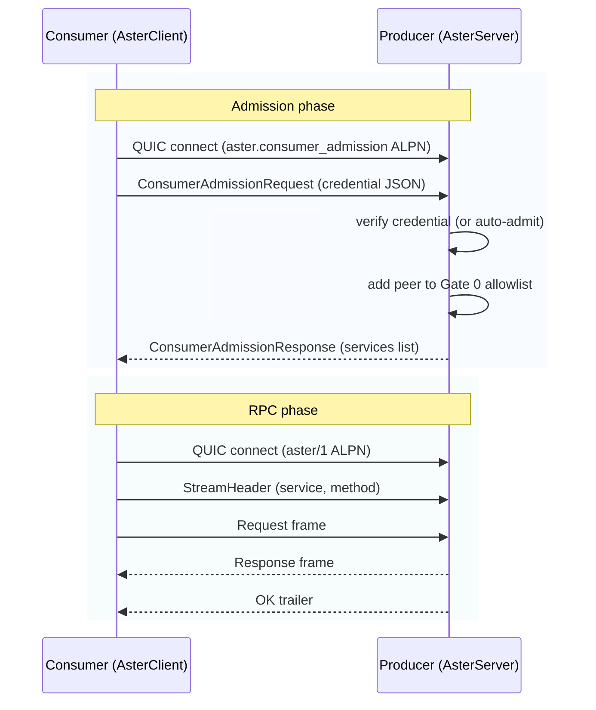

# AsterClient Usage

`AsterClient` is the consumer-side counterpart to `AsterServer`. It handles the admission handshake and RPC client construction behind a single async context manager, with all configuration driven by `AsterConfig` (environment variables or TOML file).

## Quick start

```python
import asyncio
from aster import AsterClient
from my_services import HelloService, HelloRequest

async def main():
    async with AsterClient() as c:
        hello = await c.client(HelloService)
        resp = await hello.say_hello(HelloRequest(name="World"))
        print(resp.message)

asyncio.run(main())
```

```bash
ASTER_ENDPOINT_ADDR=<from producer output> python consumer.py
```

That's it in dev mode. `AsterClient` reads configuration from `ASTER_*` environment variables automatically.


## Constructor

```python
AsterClient(
    config=AsterConfig.from_env(),          # auto-loaded when omitted
    peer="billing-consumer",               # optional: select from .aster-identity
    endpoint_addr="base64string...",        # override: producer's address
    root_pubkey=b'\x01\x02...',             # override: root public key
    enrollment_credential_file="cred.json", # override: credential path
    channel_name="rpc",                     # optional (default: "rpc")
)
```

All arguments are optional when the corresponding `ASTER_*` env vars or `.aster-identity` file are set.

### `peer` parameter

Selects a consumer peer entry from the `.aster-identity` file by name. When present, `AsterClient` loads the node secret key (for stable EndpointId), the root public key, and the signed enrollment credential from the identity file automatically.

```python
# With identity file:
async with AsterClient(peer="billing-consumer") as c:
    svc = await c.client(MyService)
    ...
```

If `peer` is omitted, `AsterClient` auto-selects the first `[[peers]]` entry with `role = "consumer"`. If no `.aster-identity` file exists, the client runs in dev mode.

### Configuration resolution (each field: inline kwarg > identity file > env var > TOML > default)

| What | Source | Purpose |
|------|--------|---------|
| Producer address | `ASTER_ENDPOINT_ADDR` or `endpoint_addr=` | **Required.** Base64 NodeAddr or EndpointId hex string. |
| Enrollment credential | `.aster-identity` `[[peers]]` entry or `ASTER_ENROLLMENT_CREDENTIAL` | Signed token for admission. Not needed in dev mode. |
| Root public key | `.aster-identity` `root_pubkey` field, `ASTER_ROOT_PUBKEY`, or `ASTER_ROOT_PUBKEY_FILE` | For validating the producer's root key in the admission response. |
| Node identity | `.aster-identity` `[node].secret_key` or `ASTER_SECRET_KEY` | 32-byte key for stable EndpointId. Ephemeral if unset. |
| IID token | `ASTER_ENROLLMENT_CREDENTIAL_IID` | Cloud Instance Identity Document (when credential requires IID). |

### Dev mode vs production

**Dev mode** (no `.aster-identity`, producer has `allow_all_consumers=True`):
```bash
ASTER_ENDPOINT_ADDR=<addr> python consumer.py
```

**Production with identity file** (recommended):
```bash
ASTER_ENDPOINT_ADDR=<addr> python consumer.py
# .aster-identity in cwd provides the credential automatically
```

**Production in containers** (identity file at a custom path):
```bash
ASTER_IDENTITY_FILE=/etc/aster/.aster-identity \
ASTER_ENDPOINT_ADDR=<addr> \
python consumer.py
```

**Legacy approach** (credential file without identity file -- still supported):
```bash
ASTER_ENDPOINT_ADDR=<addr> \
ASTER_ENROLLMENT_CREDENTIAL=consumer.token \
python consumer.py
```


## Lifecycle

### `async with AsterClient() as c:`

The context manager calls `connect()` on entry and `close()` on exit.

### `connect()`

Always runs the admission handshake (to discover available services):

```
connect()
  1. Create a QUIC endpoint (with ASTER_SECRET_KEY for stable identity if set)
  2. Connect to producer on the aster.consumer_admission ALPN
  3. If enrollment credential is configured:
     - Load from file, send with ConsumerAdmissionRequest
     - Producer verifies signature, expiry, EndpointId binding
  4. If no credential (dev mode):
     - Send empty request; producer auto-admits if allow_all_consumers=True
  5. Receive ConsumerAdmissionResponse with services list
  6. If admitted=false -> raise PermissionError
  7. Store the services list
```

After `connect()`, inspect what services the producer offers:

```python
async with AsterClient() as c:
    for s in c.services:
        print(f"{s.name} v{s.version}  contract_id={s.contract_id[:16]}...")
```

### `close()`

Closes all RPC connections and the underlying QUIC endpoint. Safe to call multiple times.


## Getting an RPC client

```python
hello = await c.client(HelloService)
```

`client()` takes a `@service`-decorated class and returns a typed `ServiceClient` with method stubs matching the service definition. Under the hood it:

1. Reads `__aster_service_info__` from the class (name, version, methods).
2. Looks up the service in the admission response's `ServiceSummary` list.
3. Opens (or reuses) a QUIC connection to the service's RPC channel on `aster/1`.
4. Creates a `ServiceClient` with `IrohTransport` and `ForyCodec`.

### Method signature

```python
await c.client(
    service_cls,                    # required: the @service-decorated class
    channel="rpc",                  # optional: override channel name
    codec=ForyCodec(...),           # optional: custom codec
    interceptors=[...],             # optional: client-side interceptors
)
```


## Making RPC calls

Once you have a client, call methods directly:

### Unary RPC

```python
hello = await c.client(HelloService)
resp = await hello.say_hello(HelloRequest(name="World"))
print(resp.message)
```

### Server streaming

```python
stocks = await c.client(StockService)
async for update in stocks.watch_price(TickerRequest(symbol="AAPL")):
    print(f"${update.price}")
```

### Client streaming

```python
uploader = await c.client(UploadService)

async def chunks():
    for data in read_file_chunks("big_file.bin"):
        yield Chunk(data=data)

result = await uploader.upload(chunks())
```

### Bidirectional streaming

```python
chat_svc = await c.client(ChatService)
channel = chat_svc.chat()
async with channel:
    await channel.send(ChatMsg(text="hello"))
    response = await channel.recv()
    print(response.text)
```


## Connection reuse

Multiple `.client()` calls to services at the same address reuse the same QUIC connection:

```python
async with AsterClient() as c:
    hello = await c.client(HelloService)    # opens connection to producer
    tasks = await c.client(TaskService)     # reuses same connection
```


## Error handling

### Admission denied

```python
try:
    async with AsterClient() as c:
        ...
except PermissionError as e:
    print(f"Admission denied: {e}")
    # "consumer admission denied — set ASTER_ENROLLMENT_CREDENTIAL to a valid enrollment token"
```

This happens when: no credential is set and the producer requires one; the credential is invalid/expired; or the root public key doesn't match.

### No endpoint address

```python
try:
    async with AsterClient() as c:  # ASTER_ENDPOINT_ADDR not set
        ...
except ValueError as e:
    print(e)  # "AsterClient requires an endpoint address. Set ASTER_ENDPOINT_ADDR..."
```

### Service not found

```python
try:
    client = await c.client(UnknownService)
except LookupError as e:
    print(e)  # "service 'UnknownService' v1 not offered by producer..."
```

### RPC errors

```python
from aster import RpcError, StatusCode

try:
    resp = await hello.say_hello(HelloRequest(name=""))
except RpcError as e:
    print(f"RPC failed: {e.code} - {e.message}")
```


## Complete production example

```python
import asyncio
from aster import AsterClient
from my_services import HelloService, HelloRequest

async def main():
    # peer= selects the consumer credential from .aster-identity
    async with AsterClient(peer="billing-consumer") as c:
        print(f"Admitted! Services:")
        for s in c.services:
            print(f"  {s.name} v{s.version} (contract: {s.contract_id[:16]}...)")

        hello = await c.client(HelloService)
        resp = await hello.say_hello(HelloRequest(name="Aster"))
        print(f"Response: {resp.message}")

asyncio.run(main())
```

```bash
# Production: .aster-identity provides credential + node identity
ASTER_ENDPOINT_ADDR=<producer addr> python consumer.py

# Or in a container with a custom identity file path:
ASTER_IDENTITY_FILE=/etc/aster/.aster-identity \
ASTER_ENDPOINT_ADDR=<producer addr> \
python consumer.py
```


## Sequence diagram


