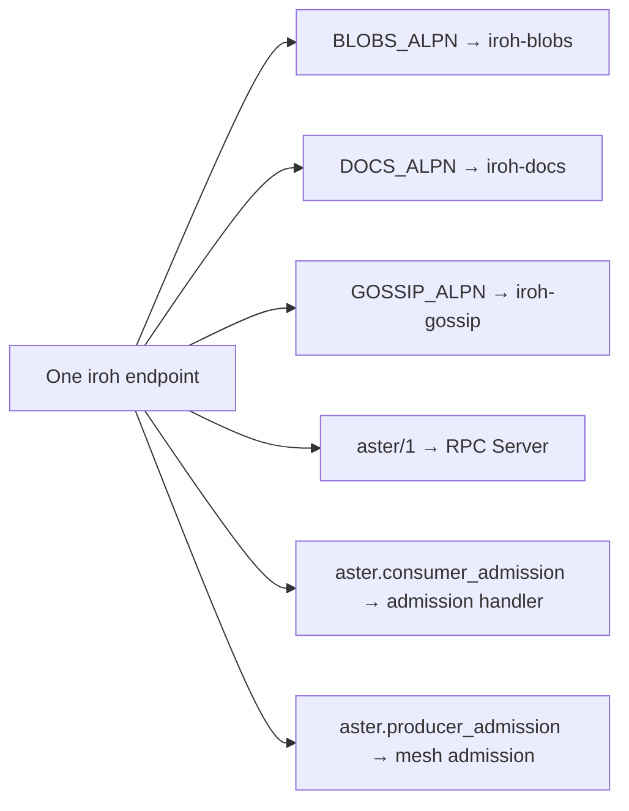

# AsterServer Deep Dive

`AsterServer` is the high-level, declarative way to stand up an Aster RPC producer. It creates a single iroh node that serves blobs, docs, gossip, Aster RPC, and admission -- all on one endpoint, one node ID. You hand it your service implementations, and it handles the rest.

## The basics

```python
from aster import AsterServer
from my_services import HelloService

async with AsterServer(services=[HelloService()]) as srv:
    print(f"Listening at: {srv.address}")
    await srv.serve()  # blocks until Ctrl+C
```

That is a complete producer. The `async with` block calls `start()` (creates the node) and `serve()` (launches accept loops), then `close()` on exit.


## Constructor

```python
AsterServer(
    services=[HelloService(), OtherService()],     # required
    config=AsterConfig(...),                        # optional
    identity=".aster-identity",                    # optional: path to identity file
    peer="billing-producer",                       # optional: select peer from identity file
    root_pubkey=b'\x01\x02...',                     # optional override
    allow_all_consumers=True,                       # optional override
    allow_all_producers=False,                      # optional override
    codec=ForyCodec(...),                           # optional
    interceptors=[DeadlineInterceptor()],           # optional
)
```

### `services` (required)

A list of `@service`-decorated class instances. At least one is required -- `AsterServer` raises `ValueError` if the list is empty.

```python
from aster import service, rpc
from dataclasses import dataclass

@dataclass
class HelloRequest:
    name: str = ""

@dataclass
class HelloResponse:
    message: str = ""

@service
class HelloService:
    @rpc
    async def say_hello(self, req: HelloRequest) -> HelloResponse:
        return HelloResponse(message=f"Hello, {req.name}!")
```

### `peer` (optional)

Selects a peer entry from the `.aster-identity` file by name. When an `.aster-identity` file is present (in the current directory or at the path set by `ASTER_IDENTITY_FILE`), `AsterServer` loads the node secret key and the matching producer credential automatically.

```python
# With identity file -- loads node key + root_pubkey from .aster-identity:
async with AsterServer(services=[MyService()], identity=".aster-identity", peer="billing-producer") as srv:
    await srv.serve()
```

If `identity` is omitted, `AsterServer` auto-detects `.aster-identity` in the current directory (or the path set by `ASTER_IDENTITY_FILE`). If `peer` is omitted, it auto-selects the first `[[peers]]` entry with `role = "producer"`. If no identity file is found, the node runs in dev mode (ephemeral identity, open gates).

The identity file provides: the node `secret_key` (stable EndpointId), the `root_pubkey` (trust anchor for the mesh), and the signed enrollment credential. You do not need to set `root_pubkey`, `ASTER_SECRET_KEY`, or `ASTER_ROOT_PUBKEY_FILE` separately when using an identity file.

### `config` (optional)

An `AsterConfig` object that bundles trust, storage, and network settings. If you do not pass one, `AsterServer` calls `AsterConfig.from_env()` automatically, which reads `ASTER_*` environment variables.

```python
from aster import AsterConfig

# From environment variables (default behavior)
config = AsterConfig.from_env()

# From a TOML file with env overrides
config = AsterConfig.from_file("aster.toml")

# Inline for testing
config = AsterConfig(
    root_pubkey=pub_bytes,
    allow_all_consumers=False,
)
```

### Inline overrides

These keyword arguments override the corresponding `AsterConfig` fields when both are present:

| Argument | Type | Default (from config) | Purpose |
|---|---|---|---|
| `peer` | `str \| None` | `None` | Select a peer entry from `.aster-identity` by name |
| `root_pubkey` | `bytes \| None` | Resolved from config or identity file | 32-byte ed25519 root public key (deployment trust anchor) |
| `allow_all_consumers` | `bool \| None` | `False` | Skip consumer admission gate |
| `allow_all_producers` | `bool \| None` | `True` | Skip producer mesh admission gate |

### Serialization and interceptors

| Argument | Type | Default | Purpose |
|---|---|---|---|
| `codec` | `ForyCodec \| None` | Auto-created XLANG codec | Custom Fory serialization codec |
| `interceptors` | `list \| None` | `[]` | Server-side interceptors applied to every RPC call |


## Lifecycle

### Phase 1: `start()`

Creates the iroh node and computes service metadata. Called automatically by `async with`.

```
start()
  1. Determine which ALPNs to register (always "aster/1", plus admission ALPNs if gates are active)
  2. Build EndpointConfig (enables hooks if Gate 0 is needed)
  3. IrohNode.memory_with_alpns(alpns, config) -- creates the unified node
  4. Compute ServiceSummary list (name, version, contract_id, channel addresses)
  5. Create the internal Server (RPC dispatcher) bound to the node
```

After `start()`, you can read properties like `srv.address` and `srv.services`.

### Phase 2: `serve()`

Spawns background tasks and returns an `asyncio.Task`. The task runs until cancelled.

```python
async with AsterServer(services=[HelloService()]) as srv:
    # serve() is called automatically by __aenter__, but you can also call it manually:
    task = srv.serve()  # returns an asyncio.Task (idempotent)
    await task           # blocks until cancellation
```

`serve()` spawns up to two subtasks:

1. **Accept loop** -- pulls `(alpn, connection)` tuples from `node.accept_aster()` and dispatches them:
   - `aster/1` connections go to the RPC `Server.handle_connection()`
   - `aster.consumer_admission` connections go to the consumer admission handler
   - `aster.producer_admission` connections go to the producer mesh admission handler

2. **Gate 0 hook loop** (only if any admission gate is active) -- drains the after-handshake hook channel and applies the `MeshEndpointHook` allowlist to every new QUIC connection.

### Phase 3: `close()`

Cancels all subtasks and shuts down the node. Called automatically by `async with` on exit.

```python
await srv.close()  # safe to call multiple times
```


## The unified node

This is the key architectural insight: `AsterServer` builds ONE iroh node with ONE endpoint ID. That single endpoint serves:



Why this matters: peers connect once and can use any protocol. A consumer that has been admitted through the admission handshake can then call RPC methods, fetch blobs, subscribe to gossip topics, and sync docs -- all through the same QUIC connection pool, the same relay, the same node ID.


## Properties

All properties require that `start()` has been called (they raise `RuntimeError` otherwise).

### Identity and addressing

```python
srv.address  # aster1... connection address (one address for everything)
srv.root_pubkey        # bytes | None -- the root public key for this deployment
```

### Service metadata

```python
srv.services  # list[ServiceSummary]
```

Each `ServiceSummary` has:
- `name` -- service name (from the `@service` decorator)
- `version` -- service version (default 1)
- `contract_id` -- deterministic BLAKE3 hash of the canonical service contract
- `channels` -- dict mapping channel name to base64 `NodeAddr`

```python
for s in srv.services:
    print(f"{s.name} v{s.version}  contract_id={s.contract_id[:16]}...")
```

### Iroh protocol access

The server exposes lazy clients for all iroh protocols:

```python
# Content-addressed blob storage
hash_and_tag = await srv.blobs.add_bytes(b"hello world")

# CRDT document sync
doc = await srv.docs.create()

# Pub-sub gossip
topic = await srv.gossip.subscribe(topic_id, [])

# Escape hatch: the raw IrohNode
node_id = srv.node.endpoint_id()
```

| Property | Type | Description |
|---|---|---|
| `srv.blobs` | `BlobsClient` | Content-addressed blob storage |
| `srv.docs` | `DocsClient` | CRDT document sync |
| `srv.gossip` | `GossipClient` | Pub-sub gossip messaging |
| `srv.node` | `IrohNode` | Raw node (escape hatch for advanced use) |
| `srv.endpoint` | `NetClient` | Low-level QUIC endpoint access |


## Admission flags

### Consumer admission (`allow_all_consumers`)

Controls whether consumers must present a credential before making RPC calls.

| Value | Behavior |
|---|---|
| `False` (default) | Consumer admission is active. The `aster.consumer_admission` ALPN is registered. Consumers must run the admission handshake (present a signed credential) before they can connect on `aster/1`. |
| `True` | No consumer gate. Anyone who knows the node address can call RPC methods directly. |

### Producer admission (`allow_all_producers`)

Controls whether other producers must be admitted before joining the mesh.

| Value | Behavior |
|---|---|
| `True` (default) | No producer gate. Any node can join the producer mesh. |
| `False` | Producer admission is active. The `aster.producer_admission` ALPN is registered. New producers must present valid enrollment credentials to join. |

### Gate 0: connection-level access control

When any admission gate is active (`allow_all_consumers=False` or `allow_all_producers=False`), the node is built with `enable_hooks=True` and a `MeshEndpointHook` runs as a background task.

Gate 0 operates at the QUIC handshake layer -- it gates ALL protocols (blobs, docs, gossip, RPC, admission) for every connection. The logic is:

1. Admission ALPNs (`aster.consumer_admission`, `aster.producer_admission`) are always allowed -- credential presentation must be possible.
2. After successful admission, the peer's endpoint ID is added to the allowlist.
3. Subsequent connections from admitted peers on any ALPN are allowed.
4. Connections from unknown peers on non-admission ALPNs are denied.

This means that if a consumer passes the admission handshake, they can subsequently fetch blobs, sync docs, and use gossip -- all gated by the same credential they presented during admission.


## Complete example

```python
import asyncio
from dataclasses import dataclass
from aster import AsterServer, AsterConfig, service, rpc

@dataclass
class TaskRequest:
    task_id: str = ""
    payload: str = ""

@dataclass
class TaskResponse:
    status: str = ""
    result: str = ""

@service("TaskRunner", version=2)
class TaskRunnerService:
    @rpc(timeout=30.0, idempotent=True)
    async def run_task(self, req: TaskRequest) -> TaskResponse:
        # Your business logic here
        return TaskResponse(status="completed", result=f"Processed {req.task_id}")

async def main():
    config = AsterConfig(
        allow_all_consumers=False,   # require consumer admission
        allow_all_producers=True,    # no producer mesh for now
    )

    async with AsterServer(
        services=[TaskRunnerService()],
        config=config,
    ) as srv:
        print(f"TaskRunner v2 serving at {srv.address}")
        print(f"Root pubkey: {srv.root_pubkey.hex()}")
        for s in srv.services:
            print(f"  {s.name} contract_id={s.contract_id}")

        # You can also use iroh protocols alongside RPC:
        blob_hash = await srv.blobs.add_bytes(b"model weights v2.1")
        print(f"Stored blob: {blob_hash}")

        await srv.serve()

asyncio.run(main())
```


## Configuration via environment

When no `config=` is passed, `AsterServer` calls `AsterConfig.from_env()`. The recommended production approach is to use an `.aster-identity` file (generated by `aster enroll node`) alongside environment variables for deployment-specific settings:

```bash
# Identity file (contains node key + enrollment credential):
ASTER_IDENTITY_FILE=/etc/aster/.aster-identity   # default: .aster-identity in cwd

# Network
ASTER_RELAY_MODE=default
ASTER_BIND_ADDR=0.0.0.0:9000

# Storage
ASTER_STORAGE_PATH=/var/lib/aster         # omit for in-memory
```

When an `.aster-identity` file is present, you do not need to set `ASTER_SECRET_KEY`, `ASTER_ROOT_PUBKEY_FILE`, or `ASTER_ENROLLMENT_CREDENTIAL` -- those values come from the identity file.

You can also use a TOML file for network and storage settings:

```toml
# aster.toml
[trust]
allow_all_consumers = false
allow_all_producers = true

[network]
relay_mode = "default"

[storage]
path = "/var/lib/aster"
```

```python
config = AsterConfig.from_file("aster.toml")
async with AsterServer(services=[...], config=config, identity=".aster-identity", peer="billing-producer") as srv:
    ...
```

Use `config.print_config()` to dump the resolved configuration with provenance tracking (which value came from which source):

```
  [trust]
    root_pubkey                 : a1b2c3d4...                        (.aster-identity)
    allow_all_consumers         : False                              (default)
    allow_all_producers         : True                               (default)
  [network]
    secret_key                  : ****...deadbeef                    (.aster-identity)
    relay_mode                  : <default>                          (default)
```
