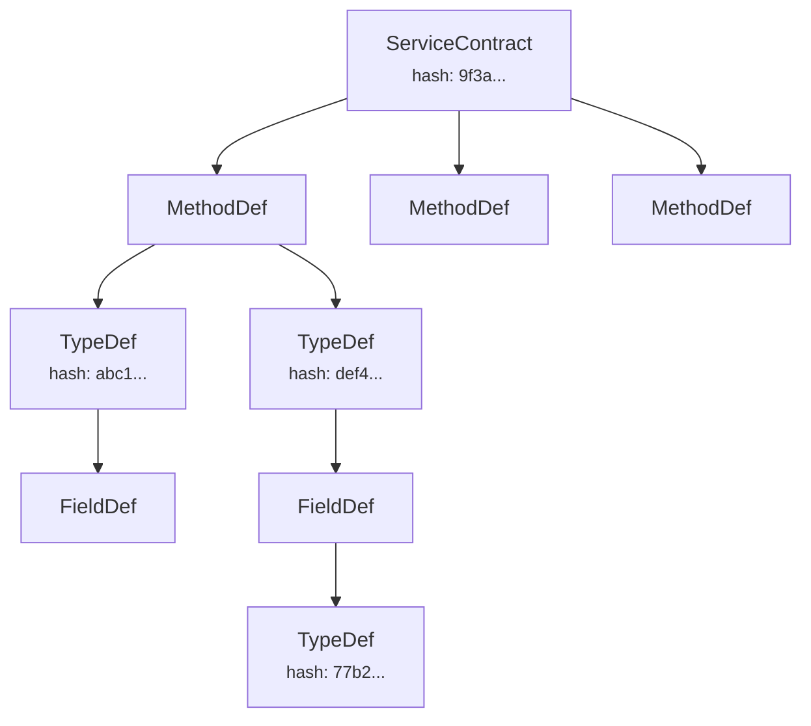

In Aster, every service contract has a deterministic, content-derived identity. The `contract_id` is the BLAKE3 hash of the contract's canonical byte representation. It is not assigned, not incremented, and not coordinated -- it is computed from the content itself.

## Content-addressed identity

A `contract_id` is derived from the contract definition, not assigned by a registry or chosen by a developer. Two implementations of the same service interface -- whether written in Python, Java, Rust, or any other supported language -- produce the same `contract_id` if they define the same methods, types, and semantics.

This is the same principle behind content-addressed storage systems like Git (SHA-1 hashes of objects) or IPFS (CIDs). The content determines the identity. No coordination required.

```
contract_id = blake3(canonical_xlang_bytes(ServiceContract))
```

## Canonical XLANG profile

For content addressing to work across languages, the serialized bytes must be identical regardless of which language produces them. Aster defines a constrained serialization profile called the **canonical XLANG profile**:

- **Fields emitted in ascending field ID order.** Not the language's natural field order, not alphabetical -- a fixed, deterministic order based on field IDs.
- **Schema-consistent mode.** No per-object type metadata in the payload. Types are known statically from the contract definition.
- **No reference tracking.** Contract descriptors are acyclic trees (with self-references handled by a placeholder mechanism), so reference tracking overhead is unnecessary.
- **Standalone serialization.** No session context, no shared caches, no state from prior objects. Each canonical byte sequence is self-contained.
- **No compression.** Canonical bytes are stored and hashed uncompressed.
- **UTF-8 strings.** All strings are encoded as UTF-8, even though Fory may normally choose LATIN1 or UTF-16 opportunistically.
- **NFC-normalized identifiers.** Method names, type names, package names, and other identifiers are normalized to Unicode NFC form before encoding. This prevents different Unicode representations of the same visual string from producing different hashes.

With these constraints, a conforming Fory implementation in any language produces byte-identical output for the same contract definition.

## Type graph: a Merkle DAG

Types reference each other by hash, forming a Merkle DAG (directed acyclic graph):



Each `TypeDef` is independently hashed. A `MethodDef` references its request and response types by hash. A `ServiceContract` references its methods. Changing any type in the graph changes its hash, which propagates upward through every contract that references it.

This gives you automatic change detection. If a type changes, every contract that uses it gets a new `contract_id`. Consumers looking up the old `contract_id` will find no providers -- a clean signal that the interface has changed, rather than a runtime deserialization error.

### Self-references and cycles

Type graphs can contain self-references (e.g., a tree node type that references itself). The canonical encoding handles this with an SCC-based (strongly connected component) cycle-breaking algorithm. Self-referential types use a placeholder hash in place of their own hash when computing canonical bytes, ensuring the encoding terminates and remains deterministic.

## ServiceContract

A `ServiceContract` is the top-level descriptor for a service:

| Field | Description |
| --- | --- |
| `name` | Service name (e.g., `"TaskManager"`) |
| `version` | Integer version number |
| `methods` | List of `MethodDef` entries, sorted by name |
| `serialization` | Default serialization modes for the service |
| `scope` | Service scope: `shared` (stateless) or `stream` (session-scoped) |

The `contract_id` is the BLAKE3 hash of the canonical XLANG serialization of this structure.

## MethodDef

Each method in a service has a `MethodDef`:

| Field | Description |
| --- | --- |
| `name` | Method name (e.g., `"assign_task"`) |
| `pattern` | RPC pattern: `UNARY`, `SERVER_STREAM`, `CLIENT_STREAM`, `BIDI_STREAM` |
| `request_type` | BLAKE3 hash of the request `TypeDef` |
| `response_type` | BLAKE3 hash of the response `TypeDef` |
| `idempotent` | Whether the method is safe to retry |
| `timeout_ms` | Default timeout in milliseconds |
| `capabilities` | Optional `CapabilityRequirement` for authorization |

### CapabilityRequirement

Methods can declare authorization requirements that the trust model enforces:

| Kind | Meaning |
| --- | --- |
| `ROLE` | Caller must have a specific role attribute |
| `ANY_OF` | Caller must have at least one of the listed capabilities |
| `ALL_OF` | Caller must have all of the listed capabilities |

These requirements are checked by framework interceptors against the attributes in the caller's `CallContext`, which are populated from their verified enrollment credential.

## What contract_id enables

**Version-safe discovery.** A consumer looks up a `contract_id` in the registry. If the service interface has changed, the old `contract_id` returns no results. The consumer knows immediately that it needs an updated client, rather than discovering the mismatch at runtime through deserialization failures.

**Compatibility detection.** The registry can store compatibility reports between contract versions. A consumer can check whether its known `contract_id` is compatible with a provider's `contract_id` before attempting a call.

**Cross-language interop verification.** A Python service and a Java client that compute the same `contract_id` are guaranteed to be wire-compatible. The hash proves that both sides agree on the exact same method signatures, type definitions, and serialization semantics.

## ContractManifest

When a contract is published to the registry, it is packaged as an iroh blob collection with a `ContractManifest` at index 0. The manifest is a JSON document that maps logical names to blob hashes:

| Member | Content | Required |
| --- | --- | --- |
| `manifest.json` | `ContractManifest` metadata | Yes |
| `contract.xlang` | Canonical XLANG bytes of `ServiceContract` | Yes |
| `types/{hash}.xlang` | Canonical XLANG bytes of each `TypeDef` | Yes |
| `schema.fdl` | Human-readable Fory IDL source | No |
| `docs/` | Documentation bundle | No |

The manifest also carries VCS provenance information (commit hash, repository URL) when available, linking the published contract back to its source. Consumers verify the contract by checking that `blake3(contract.xlang bytes) == contract_id` before trusting the bundle.
