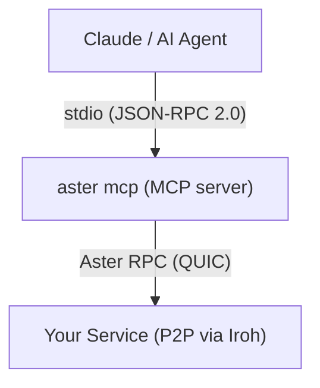

# AI Agent Integration (MCP)

Any Aster service you deploy can be instantly available to AI agents. The `aster mcp` command runs an MCP (Model Context Protocol) server that exposes your services as tools -- with full type information, dynamic discovery, and capability-based security.

No OpenAPI specs. No REST gateways. No SDK generation. The contract IS the tool definition.

## Quick start

```bash
# Terminal 1: run your service
python producer.py

# Terminal 2: expose it to AI agents via MCP
aster mcp <endpoint-addr>
```

That's it. Claude (or any MCP-compatible agent) can now discover and call your service methods.

## How it works



1. `aster mcp` connects to the producer and runs the admission handshake
2. It reads contract manifests from the registry to discover method schemas
3. Each method becomes an MCP tool with a JSON Schema derived from the request type fields
4. Tool calls are forwarded as Aster RPC calls; results returned as JSON

The MCP server does not merely list available methods -- it uses dynamic type
synthesis to actually invoke them. Contract manifests include Fory wire tags
for every field, so the server can build correctly serialized typed requests
directly from the agent's JSON arguments. No local Python type definitions or
generated stubs are needed.

The agent sees tools like:

```
HelloService:say_hello
  - name (string, required)
  - greeting (string, default: "Hello")

FileStore:get (unary)
FileStore:list (server_stream, returns array)
FileStore:upload (client_stream, accepts _items array)
```

## Security model

MCP has no built-in security. Aster fills the gap with three layers.

### Layer 1: Credential-based filtering (default)

The MCP server is just another consumer. Give it a restricted credential:

```bash
# Mint a credential specifically for AI agent use
aster trust sign --root-key root.key --type consumer \
  --attributes '{"aster.role": "ai-reader"}' --out ai-agent.token

# MCP server uses the AI's credential, not yours
aster mcp <peer> --rcan ai-agent.token
```

On the producer, declare which methods the AI role can access:

```python
@service(name="DataService")
class DataService:
    @rpc(requires=ANY_OF("reader", "ai-reader"))  # AI can read
    async def get_record(self, req): ...

    @rpc(requires=ROLE("admin"))  # AI cannot see this
    async def delete_record(self, req): ...
```

Result: the agent sees `DataService:get_record` but never knows `delete_record` exists.

### Layer 2: Allow/deny patterns

Local glob patterns as a safety net, even if the credential allows more:

```bash
# Only expose read methods
aster mcp <peer> --allow "DataService:get_*" --deny "*:delete_*"

# Only specific services
aster mcp <peer> --allow "HelloService:*" --allow "StatusService:*"
```

### Layer 3: Human-in-the-loop

Require operator approval before executing sensitive calls:

```bash
# Confirm every call
aster mcp <peer> --confirm

# Or just specific patterns
aster mcp <peer> --confirm "*.write_*" --confirm "*.admin_*"
```

The MCP server pauses, prints the call details to stderr, and waits for you to approve.

## Streaming methods

| Aster Pattern | MCP Behavior |
|---|---|
| `unary` | Direct request/response (1:1 mapping) |
| `server_stream` | Collects items into a JSON array. Control with `_max_items` (default 100) and `_timeout` (default 30s) |
| `client_stream` | Pass items via `_items` array parameter |
| `bidi_stream` | Not exposed as tools (Phase 1) |

Example: calling a server-streaming method:

```json
{
  "name": "Analytics:watchMetrics",
  "arguments": {
    "interval": 5,
    "_max_items": 10,
    "_timeout": 15
  }
}
```

Returns a JSON array of up to 10 items collected over 15 seconds.

## Demo mode

Test the MCP server without a live peer:

```bash
aster mcp --demo
```

This uses built-in sample services (HelloWorld, FileStore, Analytics) with simulated responses. Useful for testing AI agent integrations before connecting to real services.

## Configuration with Claude Code

Add to your `.claude/settings.json`:

```json
{
  "mcpServers": {
    "my-service": {
      "command": "aster",
      "args": ["mcp", "<endpoint-addr>"],
      "env": {}
    }
  }
}
```

With credentials:

```json
{
  "mcpServers": {
    "my-service": {
      "command": "aster",
      "args": ["mcp", "<endpoint-addr>", "--rcan", "ai-agent.token", "--deny", "*:delete_*"]
    }
  }
}
```

## CLI reference

```
aster mcp [peer] [options]

Arguments:
  peer                  Peer address (base64 NodeAddr). Omit for --demo mode.

Options:
  --rcan PATH           Enrollment credential for the AI agent
  --demo                Use demo data (no live peer)
  --allow PATTERN       Glob for allowed tools (repeatable)
  --deny PATTERN        Glob for denied tools (repeatable)
  --confirm PATTERN     Glob for tools requiring human approval (repeatable)
```

## What's next

- **Phase 2**: `AsterServer(mcp=True)` -- producer-side sidecar, zero network hop
- **Phase 3**: Contract manifests as MCP resources, blobs as resources, bidirectional agent-to-agent workflows
