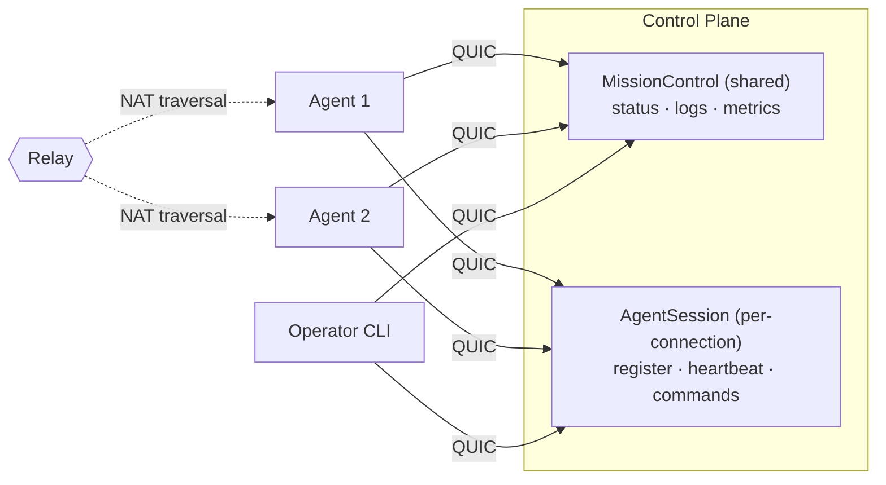

import LanguageTabs, {TabItem} from '@site/src/components/LanguageTabs';

> You need two services to talk. So you set up a load balancer, provision
> TLS certs, write protobuf schemas, compile them, configure a service mesh,
> deploy to Kubernetes, and pray the health checks converge before the
> demo tomorrow.
>
> Or: you write one file and run it.

<LanguageTabs>
<TabItem value="python">

```python
@service(name="MissionControl", version=1)
class MissionControl:
    @rpc()
    async def getStatus(self, req: StatusRequest) -> StatusResponse:
        return StatusResponse(agent_id=req.agent_id, status="running")
```

```bash
python control.py          # that's the server
aster shell aster1Qm...   # that's the client — tab completion, typed responses
```

</TabItem>
<TabItem value="typescript">

```typescript
@Service({ name: "MissionControl", version: 1 })
class MissionControl {
    @Rpc()
    async getStatus(req: StatusRequest): Promise<StatusResponse> {
        return new StatusResponse({ agent_id: req.agent_id, status: "running" });
    }
}
```

```bash
bun run control.ts             # that's the server
aster shell aster1Qm...       # that's the client — tab completion, typed responses
```

</TabItem>
</LanguageTabs>

No YAML. No protobuf compilation. No port numbers. No cloud account.
Encrypted, authenticated, works across NATs, and your colleague on the
other language can call it too.

**What you're replacing:** Traditional RPC means writing `.proto` files,
compiling them, setting up TLS certificates, configuring a reverse proxy
or service mesh so clients can find your service, managing certificate
rotation, and repeating all of that for every new service. With Aster you
get mTLS-grade mutual authentication (no CA infrastructure), gRPC-style
streaming RPCs (no `.proto` compilation), and peer-to-peer connectivity
(no port forwarding or load balancers).

This guide builds **Mission Control** — a control plane for managing
remote agents. An agent could be a CI runner, an IoT sensor, an AI
worker, or a service on your colleague's laptop across the world.

In under an hour you'll have:
- Agents that check in, push metrics, and stream logs
- Operators that watch, issue commands, and control access
- A cross-language agent talking to your control plane

Everything runs peer-to-peer. No infrastructure beyond a relay for
NAT traversal (self-hostable). Once peers find each other, traffic
flows direct.



> Aster uses [Iroh's public relays](https://iroh.computer) for discovery
> and NAT traversal by default. Point to your own with a single
> environment variable: `IROH_RELAY_URL=https://relay.yourcompany.com`.

---

## Chapter 1: Your First Agent Check-In (5 min)

**Goal:** The full working version of what you just saw — define a service,
start it, call it.

<LanguageTabs>
<TabItem value="python">

```python
# control.py
from dataclasses import dataclass
from aster import AsterServer, service, rpc, wire_type

@wire_type("mission/StatusRequest")
@dataclass
class StatusRequest:
    agent_id: str = ""

@wire_type("mission/StatusResponse")
@dataclass
class StatusResponse:
    agent_id: str = ""
    status: str = "idle"
    uptime_secs: int = 0

@service(name="MissionControl", version=1)
class MissionControl:
    @rpc()
    async def getStatus(self, req: StatusRequest) -> StatusResponse:
        return StatusResponse(
            agent_id=req.agent_id,
            status="running",
            uptime_secs=3600,
        )

async def main():
    async with AsterServer(services=[MissionControl()]) as srv:
        print(srv.address)       # compact aster1... address
        await srv.serve()

if __name__ == "__main__":
    import asyncio
    asyncio.run(main())
```

```bash
# Start the control plane
python control.py
# → aster1Qm...
```

In another terminal, connect and inspect:

```bash
aster shell aster1Qm...
> cd services/MissionControl
> ./getStatus agent_id="edge-node-7"
```

</TabItem>
<TabItem value="typescript">

```typescript
// control.ts
import { AsterServer, Service, Rpc, WireType } from '@aster-rpc/aster';

@WireType("mission/StatusRequest")
class StatusRequest {
    agent_id: string = "";
    constructor(init?: Partial<StatusRequest>) { if (init) Object.assign(this, init); }
}

@WireType("mission/StatusResponse")
class StatusResponse {
    agent_id: string = "";
    status: string = "idle";
    uptime_secs: number = 0;
    constructor(init?: Partial<StatusResponse>) { if (init) Object.assign(this, init); }
}

@Service({ name: "MissionControl", version: 1 })
class MissionControl {
    @Rpc()
    async getStatus(req: StatusRequest): Promise<StatusResponse> {
        return new StatusResponse({
            agent_id: req.agent_id,
            status: "running",
            uptime_secs: 3600,
        });
    }
}

async function main() {
    const server = new AsterServer({ services: [new MissionControl()] });
    await server.start();
    console.log(server.address);       // compact aster1... address
    await server.serve();
}

main();
```

```bash
# Start the control plane
bun run control.ts
# → aster1Qm...
```

In another terminal, connect and inspect:

```bash
aster shell aster1Qm...
> cd services/MissionControl
> ./getStatus agent_id="edge-node-7"
```

</TabItem>
</LanguageTabs>

Or skip the shell entirely — call it straight from the command line:

```bash
aster call aster1Qm... MissionControl.getStatus '{"agent_id": "edge-node-7"}'
```

> **`aster shell` vs `aster call`:** Use `aster shell` for interactive
> exploration — browsing services, tab-completing methods, streaming.
> Use `aster call` for scripting and one-shot invocations. Both use
> JSON serialization under the hood.

**What just happened:**
- Decorators defined a typed RPC contract
- `@wire_type` / `@WireType` made the types serializable across languages — no `.proto`
  files, no separate schema to maintain
- `AsterServer` created an encrypted QUIC endpoint and started listening —
  clients discover the service contract on connect
- `aster shell` connected, discovered the service, and invoked it — with
  tab completion and typed responses

---

## Chapter 2: Live Log Streaming (5 min)

**Goal:** Agents push logs into the control plane. Operators tail them
in real time using server streaming.

<LanguageTabs>
<TabItem value="python">

```python
from collections.abc import AsyncIterator
from aster import server_stream

@wire_type("mission/LogEntry")
@dataclass
class LogEntry:
    timestamp: float = 0.0
    level: str = "info"
    message: str = ""
    agent_id: str = ""

@wire_type("mission/SubmitLogResult")
@dataclass
class SubmitLogResult:
    accepted: bool = True

@wire_type("mission/TailRequest")
@dataclass
class TailRequest:
    agent_id: str = ""
    level: str = "info"    # minimum level filter

@service(name="MissionControl", version=1)
class MissionControl:
    def __init__(self):
        self._log_queue = asyncio.Queue()

    # ... getStatus from Chapter 1 ...

    @rpc()
    async def submitLog(self, entry: LogEntry) -> SubmitLogResult:
        """Agents call this to push log entries."""
        await self._log_queue.put(entry)

    @server_stream()
    async def tailLogs(self, req: TailRequest) -> AsyncIterator[LogEntry]:
        """Stream log entries as they arrive."""
        while True:
            entry = await self._log_queue.get()
            if req.agent_id and entry.agent_id != req.agent_id:
                continue
            if _level_rank(entry.level) < _level_rank(req.level):
                continue
            yield entry
```

</TabItem>
<TabItem value="typescript">

```typescript
import { ServerStream } from '@aster-rpc/aster';

@WireType("mission/LogEntry")
class LogEntry {
    timestamp: number = 0.0;
    level: string = "info";
    message: string = "";
    agent_id: string = "";
    constructor(init?: Partial<LogEntry>) { if (init) Object.assign(this, init); }
}

@WireType("mission/SubmitLogResult")
class SubmitLogResult {
    accepted: boolean = true;
    constructor(init?: Partial<SubmitLogResult>) { if (init) Object.assign(this, init); }
}

@WireType("mission/TailRequest")
class TailRequest {
    agent_id: string = "";
    level: string = "info";    // minimum level filter
    constructor(init?: Partial<TailRequest>) { if (init) Object.assign(this, init); }
}

@Service({ name: "MissionControl", version: 1 })
class MissionControl {
    private _logBuffer: LogEntry[] = [];
    private _logResolve: ((entry: LogEntry) => void) | null = null;

    // ... getStatus from Chapter 1 ...

    @Rpc()
    async submitLog(entry: LogEntry): Promise<SubmitLogResult> {
        if (this._logResolve) {
            this._logResolve(entry);
            this._logResolve = null;
        } else {
            this._logBuffer.push(entry);
        }
        return new SubmitLogResult();
    }

    @ServerStream()
    async *tailLogs(req: TailRequest): AsyncGenerator<LogEntry> {
        while (true) {
            const entry = this._logBuffer.length > 0
                ? this._logBuffer.shift()!
                : await new Promise<LogEntry>(resolve => { this._logResolve = resolve; });
            if (req.agent_id && entry.agent_id !== req.agent_id) continue;
            if (levelRank(entry.level) < levelRank(req.level)) continue;
            yield entry;
        }
    }
}
```

</TabItem>
</LanguageTabs>

```bash
# In the shell:
> ./tailLogs agent_id="edge-node-7" level="warn"
#0 {"timestamp": 1712567890.1, "level": "warn", "message": "disk 92% full", ...}
#1 {"timestamp": 1712567891.3, "level": "error", "message": "health check failed", ...}
# Ctrl+C to stop
```

> **Tip:** `tailLogs` blocks until a log entry arrives. Submit a log from
> another terminal (`aster call ... MissionControl.submitLog '{"message":"test"}'`)
> to see it appear. Press Ctrl+C to stop.

**What just happened:**
- `@server_stream` / `@ServerStream` turns an async generator into a streaming RPC
- The client receives items as they're yielded — no polling, no websockets
- Under the hood: a single QUIC stream with Aster framing, flowing until either side closes it

---

## Chapter 3: Metric Ingestion (5 min)

**Goal:** Agents push thousands of metric datapoints per second using
client streaming.

<LanguageTabs>
<TabItem value="python">

```python
@wire_type("mission/MetricPoint")
@dataclass
class MetricPoint:
    name: str = ""
    value: float = 0.0
    timestamp: float = 0.0
    tags: dict = field(default_factory=dict)

@wire_type("mission/IngestResult")
@dataclass
class IngestResult:
    accepted: int = 0
    dropped: int = 0

@service(name="MissionControl", version=1)
class MissionControl:
    # ... previous methods ...

    @client_stream()
    async def ingestMetrics(self, stream: AsyncIterator[MetricPoint]) -> IngestResult:
        """Receive a stream of metric points from an agent."""
        accepted = 0
        async for point in stream:
            self._store_metric(point)
            accepted += 1
        return IngestResult(accepted=accepted)
```

On the agent side, use a **proxy client** — quick to set up,
no types needed on the consumer side:

```python
# agent.py — proxy client (good for prototyping)
import asyncio
from aster import AsterClient

async def main():
    client = AsterClient(address="aster1Qm...")
    await client.connect()
    mc = client.proxy("MissionControl")

    # Stream 10,000 metrics — the proxy accepts dicts
    async def metrics():
        for i in range(10_000):
            from random import random
            from time import time
            yield {"name": "cpu.usage", "value": random(), "timestamp": time()}

    result = await mc.ingestMetrics(metrics())
    print(f"Accepted: {result['accepted']}")

    await client.close()

asyncio.run(main())
```

</TabItem>
<TabItem value="typescript">

```typescript
import { ClientStream } from '@aster-rpc/aster';

@WireType("mission/MetricPoint")
class MetricPoint {
    name: string = "";
    value: number = 0.0;
    timestamp: number = 0.0;
    tags: Record<string, string> = {};
    constructor(init?: Partial<MetricPoint>) { if (init) Object.assign(this, init); }
}

@WireType("mission/IngestResult")
class IngestResult {
    accepted: number = 0;
    dropped: number = 0;
    constructor(init?: Partial<IngestResult>) { if (init) Object.assign(this, init); }
}

@Service({ name: "MissionControl", version: 1 })
class MissionControl {
    // ... previous methods ...

    @ClientStream()
    async ingestMetrics(stream: AsyncIterable<MetricPoint>): Promise<IngestResult> {
        let accepted = 0;
        for await (const point of stream) {
            this.storeMetric(point);
            accepted += 1;
        }
        return new IngestResult({ accepted });
    }
}
```

On the agent side, use a **proxy client** — quick to set up,
no types needed on the consumer side:

```typescript
// agent.ts — proxy client (good for prototyping)
import { AsterClientWrapper } from '@aster-rpc/aster';

async function main() {
    const client = new AsterClientWrapper({ address: "aster1Qm..." });
    await client.connect();
    const mc = client.proxy("MissionControl");

    // Stream 10,000 metrics — the proxy accepts plain objects
    async function* metrics() {
        for (let i = 0; i < 10_000; i++) {
            yield { name: "cpu.usage", value: Math.random(), timestamp: Date.now() / 1000 };
        }
    }

    const result = await mc.ingestMetrics(metrics());
    console.log(`Accepted: ${(result as any).accepted}`);

    await client.close();
}

main();
```

</TabItem>
</LanguageTabs>

The proxy client discovers methods from the contract and sends plain
objects over the wire. Great for scripting, prototyping, and generic
gateways.

**What just happened:**
- Client streaming sends many messages, gets one response at the end
- The producer processes items as they arrive — no buffering the entire batch
- The proxy client requires no type imports — it reads the contract from
  the producer and builds method stubs dynamically
- This is how you'd build telemetry ingestion, log shipping, or bulk data upload

---

## Chapter 4: Agent Sessions & Remote Commands (5 min)

**Goal:** Each agent gets its own session — register, heartbeat, and
execute commands. This is where per-agent state and bidi streaming meet.

`MissionControl` is a shared service — one instance, all clients see the
same state. But each agent needs its own identity, capabilities, and
command channel. That's a session-scoped service:

<LanguageTabs>
<TabItem value="python">

```python
@wire_type("mission/Heartbeat")
@dataclass
class Heartbeat:
    agent_id: str = ""
    capabilities: list = field(default_factory=list)   # ["gpu", "arm64", ...]
    load_avg: float = 0.0

@wire_type("mission/Assignment")
@dataclass
class Assignment:
    task_id: str = ""
    command: str = ""

@wire_type("mission/Command")
@dataclass
class Command:
    command: str = ""

@wire_type("mission/CommandResult")
@dataclass
class CommandResult:
    stdout: str = ""
    stderr: str = ""
    exit_code: int = -1

@service(name="AgentSession", version=1, scoped="session")
class AgentSession:
    """Session-scoped: one instance per connected agent."""

    def __init__(self, peer: str | None = None):
        self._peer = peer
        self._agent_id = ""
        self._capabilities = []

    @rpc()
    async def register(self, hb: Heartbeat) -> Assignment:
        self._agent_id = hb.agent_id
        self._capabilities = hb.capabilities
        if "gpu" in hb.capabilities:
            return Assignment(task_id="train-42", command="python train.py")
        return Assignment(task_id="idle", command="sleep 60")

    @bidi_stream()
    async def runCommand(self, commands: AsyncIterator[Command]) -> AsyncIterator[CommandResult]:
        """Execute commands on this agent — stream in, results stream back."""
        async for cmd in commands:
            proc = await asyncio.create_subprocess_shell(
                cmd.command,
                stdout=asyncio.subprocess.PIPE,
                stderr=asyncio.subprocess.PIPE,
            )
            stdout, stderr = await proc.communicate()
            yield CommandResult(
                stdout=stdout.decode(),
                stderr=stderr.decode(),
                exit_code=proc.returncode,
            )
```

</TabItem>
<TabItem value="typescript">

```typescript
import { BidiStream } from '@aster-rpc/aster';

@WireType("mission/Heartbeat")
class Heartbeat {
    agent_id: string = "";
    capabilities: string[] = [];
    load_avg: number = 0.0;
    constructor(init?: Partial<Heartbeat>) { if (init) Object.assign(this, init); }
}

@WireType("mission/Assignment")
class Assignment {
    task_id: string = "";
    command: string = "";
    constructor(init?: Partial<Assignment>) { if (init) Object.assign(this, init); }
}

@WireType("mission/Command")
class Command {
    command: string = "";
    constructor(init?: Partial<Command>) { if (init) Object.assign(this, init); }
}

@WireType("mission/CommandResult")
class CommandResult {
    stdout: string = "";
    stderr: string = "";
    exit_code: number = -1;
    constructor(init?: Partial<CommandResult>) { if (init) Object.assign(this, init); }
}

@Service({ name: "AgentSession", version: 1, scoped: "session" })
class AgentSession {
    private _agent_id: string = "";
    private _capabilities: string[] = [];

    @Rpc()
    async register(hb: Heartbeat): Promise<Assignment> {
        this._agent_id = hb.agent_id;
        this._capabilities = hb.capabilities;
        if (hb.capabilities.includes("gpu")) {
            return new Assignment({ task_id: "train-42", command: "python train.py" });
        }
        return new Assignment({ task_id: "idle", command: "sleep 60" });
    }

    @BidiStream()
    async *runCommand(commands: AsyncIterable<Command>): AsyncGenerator<CommandResult> {
        for await (const cmd of commands) {
            const proc = Bun.spawn(["sh", "-c", cmd.command], {
                stdout: "pipe", stderr: "pipe",
            });
            const stdout = await new Response(proc.stdout).text();
            const stderr = await new Response(proc.stderr).text();
            const exit_code = await proc.exited;
            yield new CommandResult({ stdout, stderr, exit_code });
        }
    }
}
```

</TabItem>
</LanguageTabs>

```bash
# Operator connects and runs commands on a specific agent's session:
aster shell aster1Qm...
> cd services/AgentSession
> ./runCommand
bidi> command="df -h"
← {"stdout": "Filesystem  Size  Used ...", "exit_code": 0}
bidi> command="uptime"
← {"stdout": " 14:32  up 3 days ...", "exit_code": 0}
> end
```

**What just happened:**
- `scoped="session"` creates a fresh `AgentSession` per connection — each
  agent gets its own identity, capabilities, and command channel
- `runCommand` uses bidi streaming: commands flow in, results flow back,
  all on a single multiplexed QUIC stream
- When the agent disconnects, the session is cleaned up automatically

Two service types, two different lifetimes:
- **`MissionControl`** (shared) — fleet-wide: status, logs, metrics
- **`AgentSession`** (session) — per-agent: register, heartbeat, commands

---

## Chapter 5: Auth & Capabilities (5 min)

**Goal:** Not every caller should be able to deploy or run commands on agents.
Define roles, compose requirements, and issue scoped credentials.

The auth flow has three steps:
1. **Define** — declare which capabilities each method requires (in code)
2. **Issue** — create credentials with specific capabilities (CLI)
3. **Connect** — present the credential on connect; the framework enforces access

### Step 1: Generate a root key

```bash
# One-time setup — generates an Ed25519 keypair
aster trust keygen --out-key ~/.aster/root.key

# Output:
# Root private key written to: ~/.aster/root.key
# Root public key written to:  ~/.aster/root.pub
# Keep root.key secret. Share root.pub with nodes that need to verify credentials.
```

### Step 2: Define roles in code

<LanguageTabs>
<TabItem value="python">

```python
from enum import Enum
from aster import any_of, all_of

class Role(str, Enum):
    STATUS  = "ops.status"
    LOGS    = "ops.logs"
    ADMIN   = "ops.admin"
    INGEST  = "ops.ingest"
```

```python
@service(name="MissionControl", version=1)
class MissionControl:

    @rpc(requires=Role.STATUS)
    async def getStatus(self, req: StatusRequest) -> StatusResponse: ...

    @server_stream(requires=any_of(Role.LOGS, Role.ADMIN))
    async def tailLogs(self, req: TailRequest) -> AsyncIterator[LogEntry]: ...

    @client_stream(requires=Role.INGEST)
    async def ingestMetrics(self, stream: AsyncIterator[MetricPoint]) -> IngestResult: ...

@service(name="AgentSession", version=1, scoped="session")
class AgentSession:

    @rpc(requires=Role.INGEST)
    async def register(self, hb: Heartbeat) -> Assignment: ...

    @bidi_stream(requires=Role.ADMIN)
    async def runCommand(self, commands: AsyncIterator[Command]) -> AsyncIterator[CommandResult]: ...
```

</TabItem>
<TabItem value="typescript">

```typescript
import { anyOf, allOf } from '@aster-rpc/aster';

const Role = {
    STATUS:  "ops.status",
    LOGS:    "ops.logs",
    ADMIN:   "ops.admin",
    INGEST:  "ops.ingest",
} as const;
```

```typescript
@Service({ name: "MissionControl", version: 1 })
class MissionControl {

    @Rpc({ requires: Role.STATUS })
    async getStatus(req: StatusRequest): Promise<StatusResponse> { ... }

    @ServerStream({ requires: anyOf(Role.LOGS, Role.ADMIN) })
    async *tailLogs(req: TailRequest): AsyncGenerator<LogEntry> { ... }

    @ClientStream({ requires: Role.INGEST })
    async ingestMetrics(stream: AsyncIterable<MetricPoint>): Promise<IngestResult> { ... }
}

@Service({ name: "AgentSession", version: 1, scoped: "session" })
class AgentSession {

    @Rpc({ requires: Role.INGEST })
    async register(hb: Heartbeat): Promise<Assignment> { ... }

    @BidiStream({ requires: Role.ADMIN })
    async *runCommand(commands: AsyncIterable<Command>): AsyncGenerator<CommandResult> { ... }
}
```

</TabItem>
</LanguageTabs>

### Step 3: Start the control plane with auth

<LanguageTabs>
<TabItem value="python">

```python
config = AsterConfig(
    root_pubkey_file="~/.aster/root.pub",
    allow_all_consumers=False,
)
async with AsterServer(
    services=[MissionControl(), AgentSession()],
    identity=".aster-identity",
    config=config,
) as srv:
    print(srv.address)
    await srv.serve()
```

</TabItem>
<TabItem value="typescript">

```typescript
const server = new AsterServer({
    services: [new MissionControl(), new AgentSession()],
    identity: ".aster-identity",
    config: { rootPubkeyFile: "~/.aster/root.pub" },
    allowAllConsumers: false,
});
await server.start();
console.log(server.address);
await server.serve();
```

</TabItem>
</LanguageTabs>

### Step 4: Enroll agents

```bash
# Edge agent — status and ingest only
aster enroll node --role consumer --name "edge-node-7" \
    --capabilities ops.status,ops.ingest \
    --root-key ~/.aster/root.key

# Operator — full access including admin
aster enroll node --role consumer --name "ops-team" \
    --capabilities ops.status,ops.logs,ops.admin,ops.ingest \
    --root-key ~/.aster/root.key
```

### Step 5: Connect with credentials

<LanguageTabs>
<TabItem value="python">

```python
client = AsterClient(
    address="aster1Qm...",
    enrollment_credential_file="edge-node-7.cred",
)
await client.connect()
mc = client.proxy("MissionControl")

await mc.getStatus({"agent_id": "test"})     # ✓ has ops.status
await mc.ingestMetrics(...)                   # ✓ has ops.ingest
# await agent.runCommand(...)                 # ✗ AccessDenied — missing ops.admin
```

</TabItem>
<TabItem value="typescript">

```typescript
const client = new AsterClientWrapper({
    address: "aster1Qm...",
    enrollmentCredentialFile: "edge-node-7.cred",
});
await client.connect();
const mc = client.proxy("MissionControl");

await mc.getStatus({ agent_id: "test" });     // ✓ has ops.status
await mc.ingestMetrics(...);                   // ✓ has ops.ingest
// await agent.runCommand(...);                // ✗ AccessDenied — missing ops.admin
```

</TabItem>
</LanguageTabs>

```bash
# Or from the CLI — the shell respects credentials too
aster shell aster1Qm... --rcan ops-team.cred
> cd services/AgentSession
> ./runCommand               # ✓ ops-team has ops.admin
```

**What just happened:**
- `aster trust keygen` created the root of trust — one command
- `aster enroll node` issued scoped credentials — no CA infrastructure
- `requires=` — Aster checks at the method level, no auth middleware to write
- `any_of(A, B)` — caller needs at least one (log viewers OR admins can tail)
- The edge agent can push metrics but can't run commands. The ops team can do both.
  That's the entire access control model — defined in code, enforced at the wire level

---

## Chapter 6: Cross-Language Interop (5 min)

**Goal:** Your teammate uses a different language. They don't have your
source code — just the server address.

<LanguageTabs>
<TabItem value="python">

A TypeScript teammate calls your Python control plane:

```typescript
// Their code — no Python source needed
import { AsterClientWrapper } from '@aster-rpc/aster';

const client = new AsterClientWrapper({ address: "aster1Qm..." });
await client.connect();

const mc = client.proxy("MissionControl");
const status = await mc.getStatus({ agent_id: "ts-worker-1" });
console.log(`Status: ${status.agent_id} is ${status.status}`);

// Stream metrics from TypeScript to the Python control plane
const result = await mc.ingestMetrics(async function*() {
  for (let i = 0; i < 1000; i++) {
    yield { name: "gpu.temp", value: 72 + Math.random() * 10 };
  }
}());
console.log(`Accepted: ${result.accepted}`);
```

</TabItem>
<TabItem value="typescript">

A Python teammate calls your TypeScript control plane:

```python
from aster import AsterClient

async def main():
    client = AsterClient(address="aster1Qm...")
    await client.connect()

    mc = client.proxy("MissionControl")
    status = await mc.getStatus({"agent_id": "py-worker-1"})
    print(f"Status: {status['agent_id']} is {status['status']}")

    # Stream metrics from Python to the TypeScript control plane
    async def metrics():
        import random
        for i in range(1000):
            yield {"name": "gpu.temp", "value": 72 + random.random() * 10}

    result = await mc.ingestMetrics(metrics())
    print(f"Accepted: {result['accepted']}")

if __name__ == "__main__":
    import asyncio
    asyncio.run(main())
```

</TabItem>
</LanguageTabs>

**What just happened:**
- Your teammate never saw your source code
- The proxy client discovered the contract on connect and built method
  stubs dynamically — full RPC, no codegen required
- Same wire format, same contract hash — producer and consumer agree on
  the protocol without sharing a repo

> **"But there's no .proto file — how does the other language know what
> you sent?"** — The `@wire_type` / `@WireType` decorator registers each
> type's schema in Aster's content-addressed contract. The contract is
> published with the service and discovered on connect. The contract is
> the shared schema — you just never had to write it by hand.

---

## What's Next?

You just built a working control plane with four RPC patterns, session-scoped
agents, capability-based auth, and cross-language interop. That's a real
system — not a demo.

Next guides in the series:
- **Hardening for Production** — interceptors for retry, circuit-breaking,
  rate limiting, and deadlines
- **Scaling Out** — multiple producers with automatic fail-over
- **Artifact Distribution** — push builds and model weights to agents
  with content-addressed blobs
- **Shared Fleet State** — CRDT documents that sync across your fleet

The full source for this example is in
[`examples/python/mission_control/`](https://github.com/aster-rpc/aster-rpc/tree/main/examples/python/mission_control)
and
[`examples/typescript/missionControl/`](https://github.com/aster-rpc/aster-rpc/tree/main/examples/typescript/missionControl).
