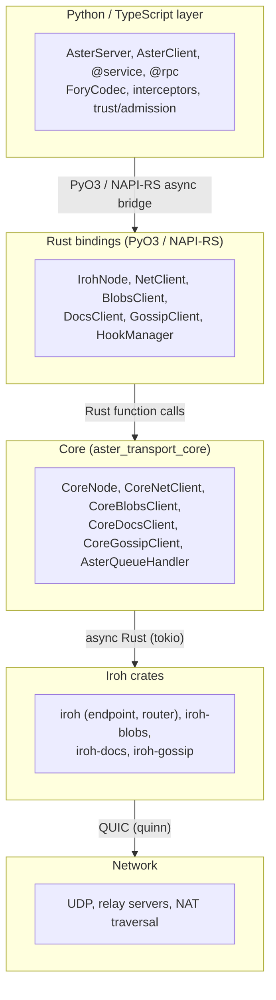
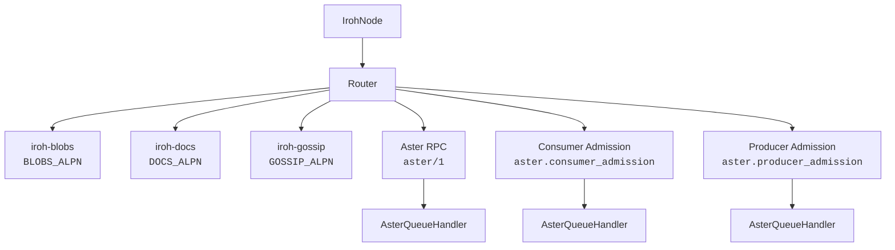
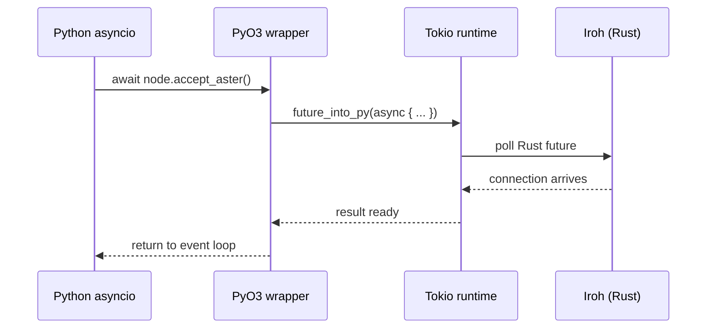
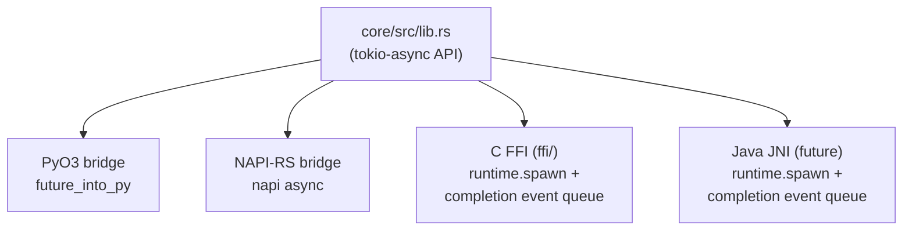
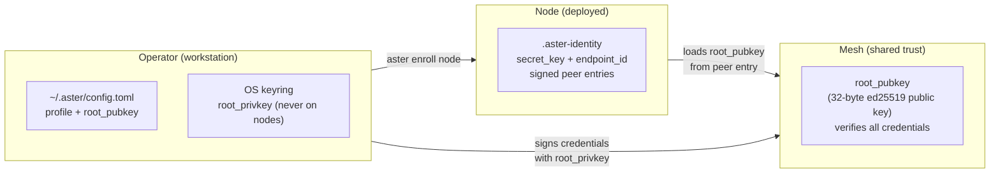
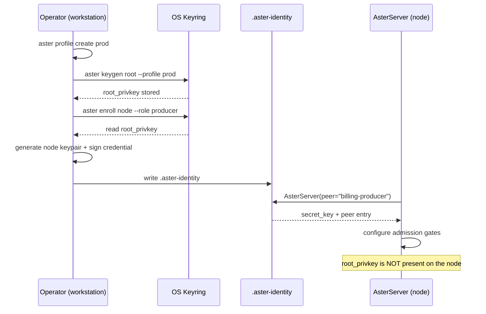
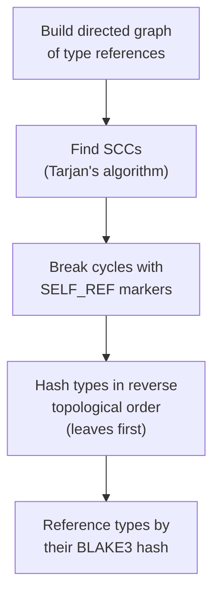
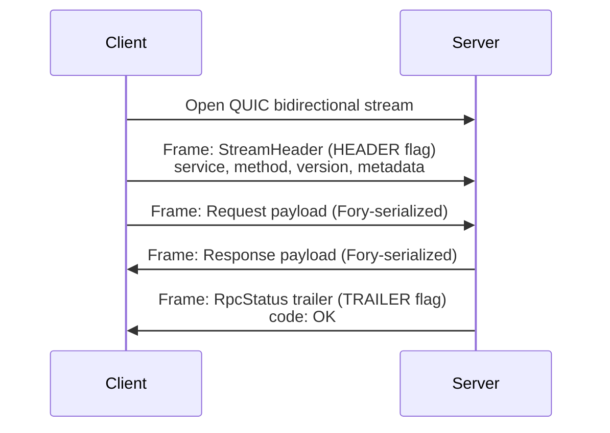
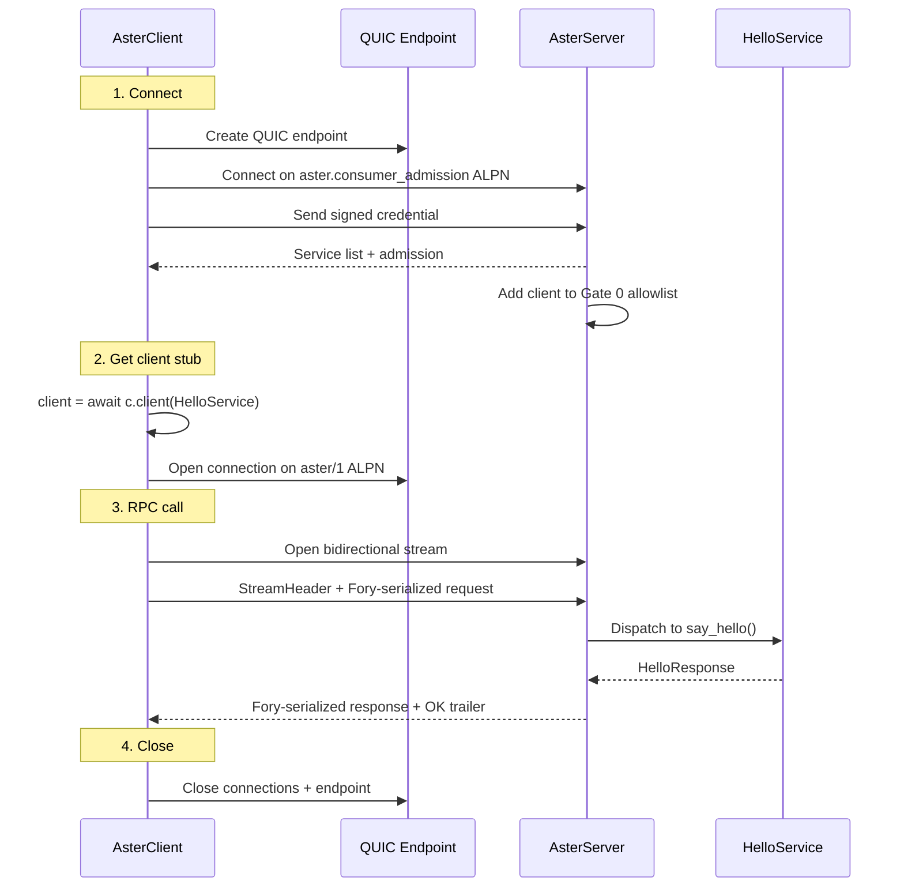

Aster is a peer-to-peer RPC framework built on top of iroh. This document explains the full stack, from the decorators you write down to the QUIC packets on the wire.

## The stack



Each layer has a clear responsibility:

- **Language layer** -- Application-facing API. Service definitions, RPC call/dispatch, serialization (Fory), interceptors, trust/admission logic. All pure Python/TypeScript except for the native bindings import.
- **Rust bindings** -- Thin PyO3/NAPI-RS wrappers that expose Rust async functions as language-native awaitables. No business logic lives here. Each wrapper calls into core and bridges the async boundary.
- **Core** -- The authoritative backend. `CoreNode` manages the iroh `Router`, which dispatches connections by ALPN. All real logic (node creation, blob operations, doc sync, gossip, connection management) lives here.
- **Iroh crates** -- The underlying P2P networking stack. Provides QUIC endpoints with relay fallback, content-addressed blob storage, CRDT document sync, and gossip pub-sub.


## The unified node

The central design decision in Aster is that everything runs through a single iroh endpoint. When `AsterServer.start()` creates the node, it registers all protocol handlers on one `Router`:



### How the Router works

Iroh's `Router` is the central connection dispatcher. When a peer opens a QUIC connection, the ALPN (Application-Layer Protocol Negotiation) string in the TLS handshake determines which `ProtocolHandler` receives the connection.

Built-in iroh protocols register their own handlers:
- `iroh-blobs` registers for `BLOBS_ALPN` (blob transfer protocol)
- `iroh-docs` registers for `DOCS_ALPN` (document sync protocol)
- `iroh-gossip` registers for `GOSSIP_ALPN` (gossip broadcast protocol)

### AsterQueueHandler

Custom Aster ALPNs (`aster/1`, `aster.consumer_admission`, `aster.producer_admission`) are each registered as an `AsterQueueHandler` instance. This is a thin `ProtocolHandler` implementation that does one thing: when a connection arrives, it places `(alpn, connection)` on a bounded tokio mpsc channel and returns.

All `AsterQueueHandler` instances share a single sender, so from the consumer's perspective there is one unified stream of incoming connections. The language layer calls `node.accept_aster()` to pull from this channel:

```rust
// Rust core (simplified)
struct AsterQueueHandler {
    alpn: Vec<u8>,
    tx: mpsc::Sender<(Vec<u8>, Connection)>,
}

impl ProtocolHandler for AsterQueueHandler {
    async fn accept(&self, conn: Connection) -> Result<()> {
        self.tx.send((self.alpn.clone(), conn)).await?;
        Ok(())
    }
}
```

The Python accept loop in `AsterServer._accept_loop()` then dispatches based on the ALPN:

```python
# Python (simplified)
while True:
    alpn, conn = await self._node.accept_aster()
    if alpn == b"aster/1":
        asyncio.create_task(self._server.handle_connection(conn))
    elif alpn == b"aster.consumer_admission":
        asyncio.create_task(handle_consumer_admission(conn, ...))
    elif alpn == b"aster.producer_admission":
        asyncio.create_task(handle_producer_admission(conn, ...))
```

### Why one endpoint matters

A single endpoint means:
- **One node ID** -- peers only need one address to reach you. The same `NodeAddr` works for RPC calls, blob downloads, doc sync, and gossip.
- **One relay connection** -- iroh maintains a persistent connection to a relay server for NAT traversal. One endpoint = one relay connection, not N.
- **Connect once, use any protocol** -- a peer that has been admitted via consumer admission can subsequently call RPC methods, fetch blobs, sync docs, and join gossip topics. No additional connections needed.
- **Gate 0 applies to everything** -- the connection-level admission hook gates ALL protocols. You cannot bypass RPC admission by connecting on the blobs ALPN.


## The async bridge

### Language bindings to Rust

The PyO3 module init starts a single shared tokio runtime. Every async Rust function exposed to Python uses `pyo3-async-runtimes::tokio::future_into_py` to convert a Rust `Future` into a Python awaitable. TypeScript uses NAPI-RS with a similar pattern.



This means:
- Python's `asyncio` event loop (or Node.js's event loop) drives the application.
- Rust's tokio runtime executes the actual I/O.
- The bridge converts between them without blocking either.
- Python tests use `asyncio_mode = "auto"` (pytest-asyncio) so every `async def test_*` just works.

### The FFI story for other languages

The core crate is designed to support multiple language bindings:



- **Python** -- `future_into_py` bridges directly because Python has native async/await.
- **TypeScript** -- NAPI-RS async tasks bridge to Node.js promises.
- **C FFI** -- `runtime.spawn()` kicks off the async operation, then signals completion via an event queue. The C caller polls for results.
- **Java/Go** (future) -- Same `runtime.spawn()` + completion pattern.

The key insight: no new concurrency primitives cross the FFI boundary. The core crate speaks pure tokio async. Each binding layer adapts that to its language's concurrency model.


## Identity and profile architecture

Aster separates three concerns in its trust and identity model:



### Operator layer

The operator manages deployment meshes from a workstation. The CLI profile system (`aster profile create/list/use/show/delete`) stores mesh metadata in `~/.aster/config.toml`. The root private key -- the most sensitive secret -- is stored in the OS keyring via the `keyring` package, scoped by profile name (`root_privkey:{name}`). It never touches a running Aster node.

### Node layer

Each deployed node has an `.aster-identity` file containing its secret key (for stable EndpointId) and one or more signed peer entries (enrollment credentials). The file is generated by `aster enroll node` on the operator's machine and deployed alongside the application. A single identity file can hold credentials for multiple meshes and roles.

### Mesh layer

A mesh is defined by its root public key. All nodes in the same mesh share the same root public key and use it to verify enrollment credentials. When `AsterServer` or `AsterClient` loads a peer entry from `.aster-identity`, the `root_pubkey` field in that entry tells the node which mesh it belongs to.

### Configuration flow



In dev mode (no `.aster-identity`), the entire identity/profile system is bypassed. Ephemeral keys are generated in memory, consumer gates are opened, and everything works without any files.


## Contract identity

Every `@service`-decorated class gets a deterministic `contract_id` -- a BLAKE3 hash of the service's canonical form. This is how Aster knows two services are the same, even across languages.

### How it works

1. The `@service` decorator scans the class and extracts a `ServiceInfo`: method names, parameter types, return types, patterns (unary/streaming), version.

2. `contract_id_from_service(cls)` builds a `ServiceContract` -- a normalized data structure containing:
   - Service name (NFC-normalized Unicode)
   - Version number
   - Scope (shared or stream)
   - Each method: name, pattern, request type graph, response type graph
   - Type definitions: field names, field types, containers (list/set/map), nested references

3. The `ServiceContract` is serialized to bytes using a canonical binary format:
   - Deterministic field ordering (alphabetical by spec)
   - varint length-prefixed strings
   - zigzag-encoded integers
   - No padding, no alignment

4. The bytes are hashed with BLAKE3, producing a 32-byte digest (displayed as 64-char hex).

### Why this matters

The contract_id is the same for any implementation that defines the same methods with the same types at the same version. A Python service and a TypeScript service with identical method signatures produce identical contract IDs. This enables:

- **Safe client/server version checking** -- the consumer's contract_id must match the producer's.
- **Registry deduplication** -- two producers serving the same contract are interchangeable.
- **Cross-language interop** -- a Python client can call a TypeScript server (or vice versa) as long as contract IDs match.

### Type graph resolution

Types can be recursive (e.g., a tree node that contains child tree nodes). The contract identity system handles this using Tarjan's algorithm for strongly connected components (SCC):



This ensures that even recursive types produce a stable, deterministic contract_id.


## RPC wire protocol

When a client calls an RPC method, here is what happens on the wire:



Each frame is length-prefixed with flags:
- `HEADER` (0x04) -- first frame contains the `StreamHeader`
- `TRAILER` (0x02) -- last frame contains `RpcStatus` (success or error)
- `COMPRESSED` (0x01) -- payload is zstd-compressed (auto for payloads > 4KB)

Serialization uses Apache Fory in XLANG (cross-language) mode by default. The `ForyCodec` handles encoding/decoding and transparent compression.


## Putting it all together

Here is the complete flow of an RPC call from `AsterClient` to `AsterServer`:



All of this happens over iroh's QUIC transport with automatic relay fallback, NAT traversal, and connection migration. The application code sees none of this complexity -- just `await hello.say_hello(request)`.
